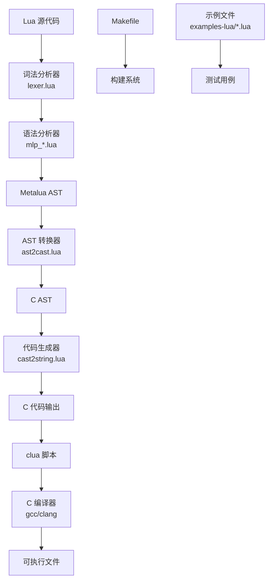

# Lua2C 架构分析

## 系统架构图

## 模块详细分析

### 1. 词法分析器 (lexer.lua)

负责将 Lua 源代码分解为标记流：
- 识别关键字、标识符、数字、字符串等
- 处理注释（短注释和长注释）
- 处理转义字符
- 管理行号和位置信息

### 2. 语法分析器 (mlp_*.lua)

基于 Metalua 的解析器组件：
- mlp_expr.lua: 表达式解析
- mlp_stat.lua: 语句解析
- mlp_table.lua: 表构造解析
- 其他模块处理不同的语法结构

### 3. AST 转换器 (ast2cast.lua)

核心转换模块，包含以下主要组件：

#### 3.1 作用域管理
- `_currentscope`: 当前作用域信息
- `localidx()`: 获取局部变量索引
- `newscope()/restore_scope()`: 作用域管理

#### 3.2 表达式生成
- `genexpr()`: 表达式生成主函数
- `genarithbinop()`: 算术运算符
- `geneqop(), genltop(), genleop()`: 比较运算符
- `genlogbinop(), gennotop()`: 逻辑运算符
- `genconcatop()`: 连接运算符
- `genlenop(), genunmop()`: 一元运算符

#### 3.3 语句生成
- `genstatement()`: 语句生成主函数
- `genif()`: 条件语句
- `genwhile(), genrepeat()`: 循环语句
- `genfornum(), genforin()`: for 循环
- `genfunction()`: 函数定义

#### 3.4 闭包和上值处理
- `gennewclosuretable()`: 创建闭包表
- `gen_lc_setupvalue(), gen_lc_getupvalue()`: 上值操作
- `first_pass()`: 第一次遍历标记上值使用

### 4. 代码生成器 (cast2string.lua)

将 C AST 转换为 C 代码字符串：
- `cast_to_string()`: 主转换函数
- 处理各种 C AST 节点类型
- 格式化和缩进
- 添加分号和大括号

## 数据流分析

### 1. 编译过程数据流

### 2. C AST 结构

C AST 节点包含以下字段：
- `tag`: 节点类型
- `idx`: 栈索引
- `pre`: 预处理代码
- `comment`: 注释信息
- 其他特定于节点类型的数据

## 关键设计决策

### 1. 栈管理策略

- 使用 `_idxtop` 跟踪栈顶位置
- `idxtop_change(), idxtop_restore()`: 栈操作
- `realidx()`: 调整索引以考虑可变参数函数

### 2. 闭包实现

- 使用闭包表管理上值
- 层级结构支持嵌套闭包
- 生成专门的函数处理上值访问和设置

### 3. 代码生成优化

- 常量折叠
- 避免不必要的栈操作
- 生成调试断言确保栈一致性

## 性能考虑

### 1. 栈操作优化
- 尽量减少栈操作次数
- 批量处理栈清理

### 2. 内存管理
- 重用临时变量
- 优化闭包表结构

### 3. 代码质量
- 生成可读的 C 代码
- 保留原始 Lua 注释

## 扩展性分析

### 1. 添加新运算符
- 在 `is_binopid, is_unopid` 中添加标识符
- 实现相应的生成函数
- 更新 `genexpr()` 分发逻辑

### 2. 添加新语句类型
- 实现语句生成函数
- 更新 `genstatement()` 分发逻辑
- 处理作用域和栈管理

### 3. 改进代码生成
- 添加新的优化 passes
- 改进寄存器分配
- 优化控制流生成